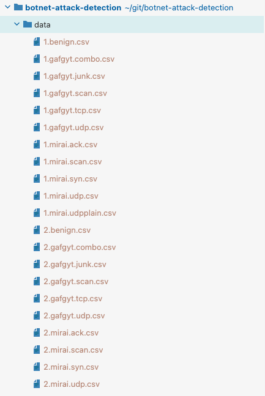

# [Scada Intrusion Detection](https://github.com/FGRCL/scada-intrusion-detection)
botnet attack detection using anomaly detection and classification

## Results
Preprocessed results are available in the jupyter notebook `results.ipynb`

## Using the scripts

### training a models
start the script `src/train.py` for training and `src/tune.py` for tuning. 

#### model arguments
pass the model name as argument to train it. We currently support the following models
```shell
--randomforest
--kmeans
--pca
--gmm
--svm
--adaboost
--knn
```

#### other arguements
```shell
-v #verbosity of the output
```

#### example
```shell
python -m src.train --randomforest -v 4
```
```shell
python -m src.tune --pca --adaboost -v 4
```

## Setting up your environments

### Output
the outputs of the script will be saved in the `out` folder at the root of the project

### Requirements
You'll need the following software installed to set up your environment.
- [python 3.10](https://www.python.org/)
- [pipenv](https://pipenv.pypa.io/en/latest/)

### Development Environment
1. Clone the repository
```shell
git clone git@github.com:FGRCL/botnet-attack-detection.git
```
2. install the environment
```shell
pipenv install
```
3. Change your IDE's python interpreter to the one pipenv just created for the proejct
    - [Follow this guide if you use intellij](https://www.jetbrains.com/help/idea/pipenv.html)
    - [Follow this guide if you use pycharm](https://www.jetbrains.com/help/pycharm/pipenv.html)
    - [Follow this guide if you use vs-code](https://code.visualstudio.com/docs/python/environments#_work-with-python-interpreters)

### Getting the data

1. Get the dataset from [ece.uah.edu](http://www.ece.uah.edu/~thm0009/icsdatasets/gas_final.arff) or ask one of the contributors for a copy of the dataset
2. Add the datasets file to a folder called `data` at the root of the directory.


